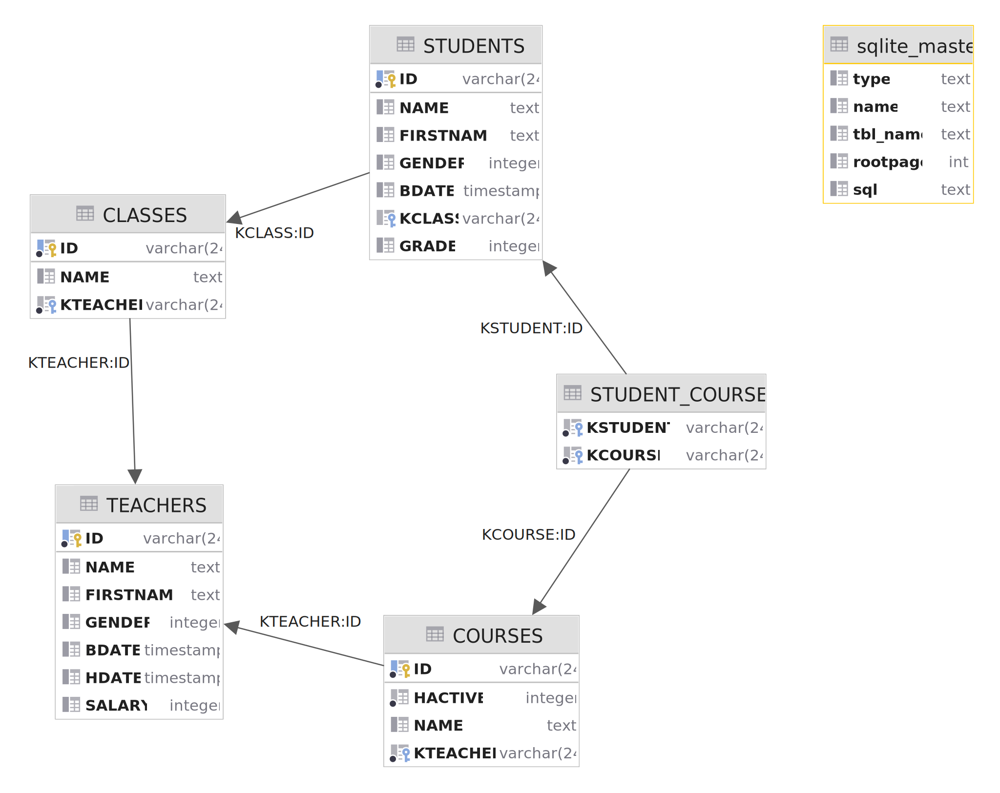

# swe3-csharp-orm


# Usage
This ORM Framework uses Attributes/Annotations to manage metadata. To see an example usage check the Model Project.
There are the following Attributes:
- Entity stores the table name
- Field Stores the column name, column type and nullable constraint
  - Primary key indicates that a field is a primary key (Note: composite primary keys are not possible)
  - Foreign key indicates that a field is a foreign key (also stores relation table for m:n relations)
  - Ignore ORM Framework ignores these fields.

To see how to use the model check out the Unit tests are tests for each major feature.

Please note that Queries are lazily loaded.

# Database Schema
Schema used for this example:

Create statements for SQLite:
```
create table TEACHERS
(
    ID        VARCHAR(24) not null
        primary key,
    NAME      TEXT,
    FIRSTNAME TEXT,
    GENDER    INTEGER,
    BDATE     TIMESTAMP,
    HDATE     TIMESTAMP,
    SALARY    INTEGER
);
create table CLASSES
(
    ID       VARCHAR(24) not null
        primary key,
    NAME     TEXT,
    KTEACHER VARCHAR(24) not null
        references TEACHERS
);
create table STUDENTS
(
    ID        VARCHAR(24) not null
        primary key,
    NAME      TEXT,
    FIRSTNAME TEXT,
    GENDER    INTEGER,
    BDATE     TIMESTAMP,
    KCLASS    VARCHAR(24)
        references CLASSES,
    GRADE     INTEGER
);
create table COURSES
(
    ID       VARCHAR(24) not null
        primary key,
    HACTIVE  INTEGER default 0 not null,
    NAME     TEXT,
    KTEACHER VARCHAR(24) not null
        references TEACHERS
);
create table STUDENT_COURSES
(
    KSTUDENT VARCHAR(24) not null
        references STUDENTS,
    KCOURSE  VARCHAR(24) not null
        references COURSES
);
```
